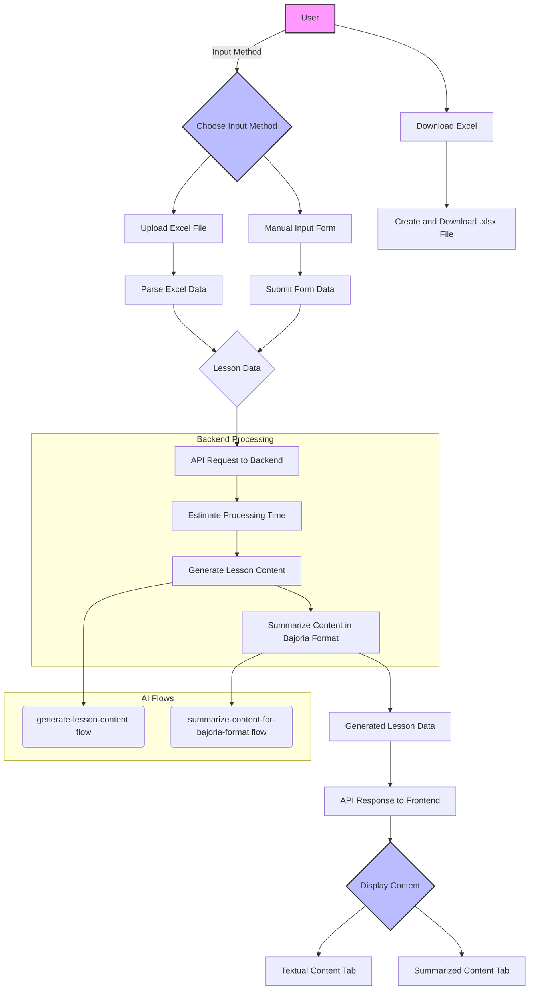

# HVscribe

HVscribe is a powerful and intuitive tool designed to automatically generate high-quality educational content from lesson names and slide materials. By leveraging the capabilities of generative AI, HVscribe transforms raw inputs into well-structured, engaging, and informative lessons in markdown format.

## Key Features

- **Automated Content Generation**: Quickly create detailed lesson content from just a lesson name and slides.
- **Flexible Input Methods**: Supports two convenient ways to provide input:
  - **Excel Upload**: Batch process multiple lessons by uploading a `.xlsx` file with columns for "Lesson Name" and "Slides".
  - **Manual Entry**: Directly input the lesson name and slides content through a user-friendly form.
- **Dual Content Output**: For each lesson, HVscribe generates two distinct versions:
  - **Textual Content**: A comprehensive, well-structured markdown file, perfect for in-depth study and reading.
  - **Summarized Content**: A concise summary in the Bajoria format, ideal for quick reviews and Q&A sessions.
- **Interactive UI**: A sleek and responsive interface built with Next.js and Tailwind CSS, providing a seamless user experience.
- **Downloadable Lessons**: Easily download your generated lessons as a single, organized Excel file.

## Tech Stack

- **Frontend**: [Next.js](https://nextjs.org/), [React](https://reactjs.org/), [Tailwind CSS](https://tailwindcss.com/), [Shadcn UI](https://ui.shadcn.com/)
- **Backend**: [Next.js API Routes](https://nextjs.org/docs/api-routes/introduction)
- **AI**: [Google's Genkit](https://firebase.google.com/docs/genkit)
- **File Handling**: [XLSX](https://github.com/SheetJS/sheetjs)

## Architecture and Data Flow

HVscribe follows a modern, serverless architecture that ensures scalability and a smooth user experience. The data flow is designed to be efficient and straightforward, from user input to the final generated content.

### Data Flow Diagram

The following diagram illustrates the flow of data through the HVscribe application:



### Explanation of the Data Flow

1.  **User Input**: The user starts by choosing an input method: either uploading an Excel file or using the manual input form.
2.  **Data Extraction**: The application extracts the lesson name and slides content from the user's input.
3.  **API Request**: The frontend sends the extracted data to the backend via an API request.
4.  **Backend Processing**: The backend processes the request in three main steps:
    - **Estimate Time**: It first estimates the total time required to generate the lessons.
    - **Generate Content**: The `generate-lesson-content` AI flow is invoked to create the detailed textual content for each lesson.
    - **Summarize Content**: The `summarize-content-for-bajoria-format` AI flow is then used to generate a concise summary of the content.
5.  **API Response**: The backend returns the generated textual and summarized content to the frontend.
6.  **Display Content**: The frontend dynamically displays the generated content in two separate tabs, allowing the user to easily switch between the detailed lesson and the summary.
7.  **Download**: The user can download all the generated lessons, including the original slides content and both versions of the generated content, as a single `.xlsx` file.

## Getting Started

To run HVscribe locally, follow these steps:

1.  **Clone the repository**:

    ```bash
    git clone https://github.com/your-username/hvscribe.git
    cd hvscribe
    ```

2.  **Install dependencies**:

    ```bash
    npm install
    ```

3.  **Set up environment variables**:

    Create a `.env.local` file in the root of the project and add your Google AI API key:

    ```
    GOOGLE_API_KEY=your_google_api_key
    ```

4.  **Run the development server**:

    ```bash
    npm run dev
    ```

5.  **Open the application**:

    Open your browser and navigate to `http://localhost:3000`.

## Usage

Using HVscribe is simple and intuitive:

1.  **Choose your input method**: Select either "Upload Excel" or "Manual Input".
2.  **Provide the content**:
    - For Excel, make sure your file has the columns "Lesson Name" and "Slides".
    - For manual input, fill in the respective fields in the form.
3.  **Generate**: Click the "Generate Lesson" button.
4.  **View and Download**: Once the generation is complete, you can view the content in the respective tabs and download all lessons as an Excel file.

## AI Flows

HVscribe utilizes two core AI flows to generate the educational content:

- **`generate-lesson-content`**: This flow takes a lesson name and slides content as input and generates a detailed, well-structured lesson in markdown format. It includes a title, introduction, sectioned content, examples, interactive elements, and a summary.
- **`summarize-content-for-bajoria-format`**: This flow is designed to create a concise and scannable summary of the lesson content, following the Bajoria format. This format is optimized for quick reviews and for powering AI-driven Q&A experiences.

## Contributing

Contributions are welcome! If you have any ideas, suggestions, or bug reports, please open an issue or submit a pull request. For major changes, please open an issue first to discuss what you would like to change.

---

*This README was generated with the help of an AI assistant.*
